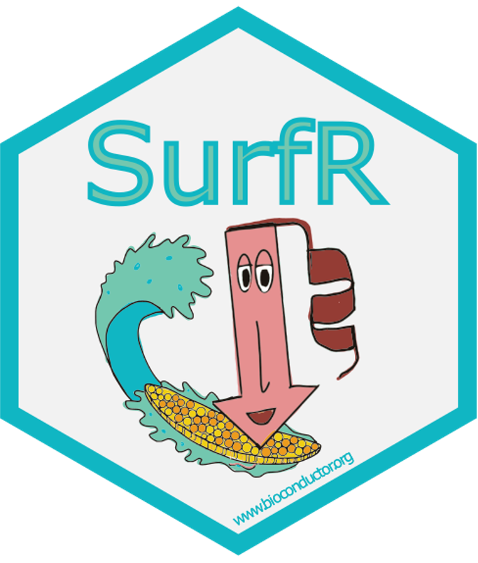

# _SurfR applications_
# Cancer: cholangiocarcinoma

## [SurfR](https://www.bioconductor.org/packages/release/bioc/html/SurfR.html) Bioconductor package use-case R code.

### Bulk RNA-Seq re-analysis of:
- GSE107943 dataset
- TCGA.CHOL dataset

### References

Ahn KS, Kang KJ, Kim YH, Kim TS et al. 
Genetic features associated with (18)F-FDG uptake in intrahepatic cholangiocarcinoma. 
Ann Surg Treat Res 2019 Apr;96(4):153-161

The Cancer Genome Atlas Research Network., Weinstein, J., Collisson, E. et al.
The Cancer Genome Atlas Pan-Cancer analysis project. Nat Genet , 2013, 45:1113–1120.
