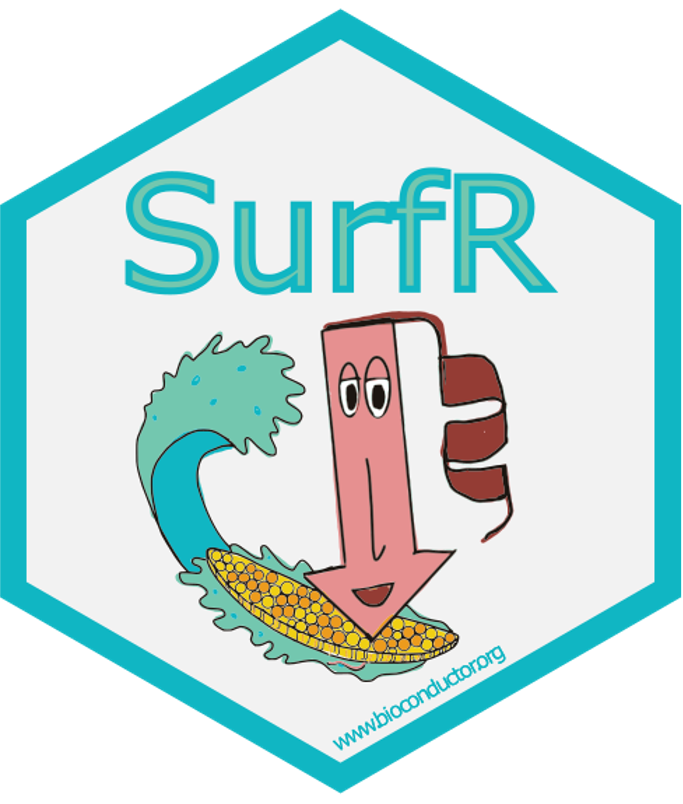

# _SurfR applications_

# Neurobiology: Peripheral Nerve Injury (PNI)

## [SurfR](https://www.bioconductor.org/packages/release/bioc/html/SurfR.html) Bioconductor package "beyond cancer" use-case R code.

 
### Bulk RNA-Seq re-analysis of GSE90711 dataset. 

### References

Weiss T, Taschner-Mandl S, Bileck A, Slany A et al. 
Proteomics and transcriptomics of peripheral nerve tissue and cells unravel new aspects of the human Schwann cell repair phenotype. 
Glia 2016 Dec;64(12):2133-2153. PMID: 27545331.

